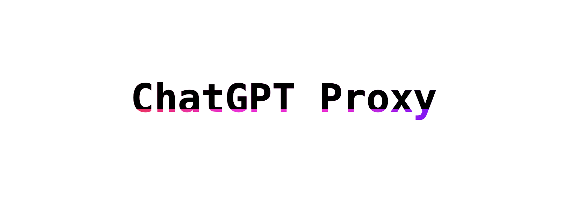

One-click deployment of the ChatGPT private proxy, power by Next.js

English | [简体中文](./README-CN.md)

## Introduction

This project is based on Next.js, use Rewriter to complete proxy function, only [2 lines](https://github.com/imyuanx/chatgpt-proxy/blob/main/next.config.js#L7-L8) of core code, combining Zeabur or Vercel can easily host your private proxy service

### [Demo](https://chatgpt-proxy-preview.zeabur.app)

Before you start, you'd better check the [How to use](#how-to-use) section to determine whether this project is applicable to you

## Quick jump

- [Deploy on Zeabur](#deploy-on-zeabur)
- [Deploy on Vercel](#deploy-on-vercel)
- [Deploy on your server](#deploy-on-your-server)
- [How to use](#how-to-use)

## Deploy on Zeabur

The Zeabur is recommended, Specific operations are as follows

1. Fork this repository for your own repository

2. Add a new service on [Zeabur](https://zeabur.com) console

3. Add service and deploy from source code

4. Select your forked repo

5. Select main and deploy

6. After the deployment is successful, Generate the domain name.

7. Finally get your service

## Deploy on Vercel

> ❗️⚠️❗️**Warning: This project may violate the [Never Fair Use - Proxies and VPNs](https://vercel.com/docs/concepts/limits/fair-use-policy#never-fair-use) entries under the Vercel Terms of Use. Vercel hosting this project is strongly not recommended!**
>
> ❗️⚠️❗️**Warning: If your account is punished due to the deployment of this project to Vercel, please bear the consequences**

If you use Vercel deploy services, you must [custom domain name](https://vercel.com/docs/concepts/get-started/assign-domain), beacuse the [custom domain name](https://vercel.com/docs/concepts/get-started/assign-domain) is not affected by the GFW, Specific operations are as follows

1. Click the deploy button at the top

2. After deployment, the repository will be forked automatically for you, entering a custom repository name in the input field

3. After successful deployment, get your service

4. You must add a custom domain name for your service, otherwise you will not be able to access your service in the country

## Deploy on your server

> You must have a server and make sure your server can access ChatGPT, if not you can deploy on [Zeabur](#deploy-on-zeabur) / [Vercel](#deploy-on-vercel)
>
> You need some knowledge about [Docker](https://www.docker.com/)

1. Fork this repository for your own repository

2. Switch to the your forked project directory and run `docker build -t chatgpt-proxy .`

3. then run `docker run --name chatgpt-proxy -d -p 8000:3000 chatgpt-proxy`

4. open `http://127.0.0.1:8000` on your browser

## How to use

Whether you use Zeabur or Vercel, you will get the following proxy service after deployment

The address in the red box is fully forwarded to `https://api.openai.com` and is accessible within the country

You can use the proxy service in applications that support custom apis to invoke the "openai" interface domestically

Fro example, [openai-translator](https://github.com/yetone/openai-translator):

[Back to top](#introduction)
